<h1 align="center">牌九的艺术与博弈</h1>

## 目录

### 1. 序言

### 2. 简介

### 3. 基本规则

### 4. 牌型介绍

### 5. 玩法细则

### 6. 结语

---

## 序言

牌九是一种流传千年的传统棋牌类游戏，凭借其独特的规则、丰富的策略性和深厚的文化底蕴，成为中华文化中的重要组成部分。无论是在古代的茶馆赌坊，还是现代的娱乐场所，牌九始终以其独特的魅力吸引着众多爱好者。

本文旨在系统介绍牌九的玩法规则，使玩家能够迅速理解其基本概念，并掌握游戏的核心技巧。内容涵盖牌九的基本规则、牌型介绍、详细玩法解析及胜负判定方法，同时探讨其历史渊源、不同地区的演变，以及实战中的策略运用。

无论是初学者，还是希望提升牌技的进阶玩家，都可在本文中找到有价值的信息。本书将帮助玩家全面理解牌九的玩法，提升对游戏的掌控力，并在实践中获得更好的体验。

## 简介

牌九，又称“骨牌”，是一种起源于中国的传统纸牌游戏，历史可追溯至宋朝。其玩法类似于西方的“二十一点”，但使用的是中国特有的“天九牌”牌组。牌九在中国民间广泛流传，并且对东南亚、港澳台地区的博彩文化产生了深远影响。

牌九使用一副32张的骨牌，每张牌的点数是由两颗骰子的点数组合而成。这些牌按照点数分为“文牌”和“武牌”两大类，其中文牌主要由“天九”牌组成，而武牌的点数组合较为分散。尽管牌九的规则因地域不同有所差异，但核心玩法通常涉及对子、大小比较和点数计算。

牌九的计分方式以牌点相加后取个位数来计算胜负，最高点数为“九点”。此外，某些特定的牌型，如“至尊宝”（天牌与地牌的组合），可以在特定规则下直接获胜。这种独特的计分方式使得牌九不仅考验运气，也考验玩家的记忆力和策略。

在明清时期，牌九广泛流行于民间和赌场，并成为广东、福建等地的重要娱乐活动之一。到了近现代，牌九更是与澳门及东南亚的博彩业紧密结合，成为赌场中不可或缺的项目之一。尽管现代社会的娱乐方式不断变化，但牌九仍然在传统文化和博彩领域占有重要地位。

新蔡县位于中国河南省东南部，隶属驻马店市，地处淮河流域，总面积1453平方公里，人口约130万。历史悠久，为蔡姓发源地，古称“蔡州”。境内有洪汝河等河流，风景秀丽，古迹众多，如蔡国故城遗址，文化底蕴深厚。

本文则以新蔡县域牌九玩法展开，着重讲解玩法规则、游戏技巧和博弈策略。

## 基本规则

新蔡县域的牌九共32张骨牌，主要分为天地人鹅麻长板等牌型，素有"天九为王，对子来降"、"三六一只鹅，神仙治不活"、"天留九，地留杠"、"天地不配，回家瞌睡"等脍炙人口的顺口溜。其位置分配为庄家、掌门、天门、末门，如下图所示。

牌九的玩法又分为大牌九、小牌九、接龙杠和扛天杠。本文以大牌九详细介绍玩法规则，其他玩法大同小异。

庄家首先摇掷骰子，以三组骰子为例，总点数对4取模，余数0、1、2、3分别对应末门、庄家、掌门、天门，然后按顺序起牌。

大牌九两两一组，分为"头牌"和"尾牌"。以庄家为例，只有"头牌"和"尾牌"都大于其他三门才算赢牌，如果只有一头赢,另一头输则算和牌，俗称"够本"。相同牌型情况下，庄家为大。一般情况下，头牌要比尾牌小。

## 牌型介绍

32张骨牌的牌型如下：

<figure>
    
    
牌型图

</figure>

单张牌又分为：

  <figure style="text-align: center; margin: 0;">
    
    <figcaption>天牌</figcaption>
  </figure>

  <figure style="text-align: center; margin: 0;">
    
    <figcaption>地牌</figcaption>
  </figure>

  <figure style="text-align: center; margin: 0;">
    
    <figcaption>人牌</figcaption>
  </figure>

 <figure style="text-align: center; margin: 0;">
    
    <figcaption>鹅牌</figcaption>
  </figure>

  <figure style="text-align: center; margin: 0;">
    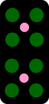
    <figcaption>麻包</figcaption>
  </figure>

  <figure style="text-align: center; margin: 0;">
    
    <figcaption>长三</figcaption>
  </figure>

  <figure style="text-align: center; margin: 0;">
    
    <figcaption>板凳</figcaption>
  </figure>

 <figure style="text-align: center; margin: 0;">
    
    <figcaption>斧贲</figcaption>
  </figure>

 <figure style="text-align: center; margin: 0;">
    
    <figcaption>黄ou</figcaption>
  </figure>

  <figure style="text-align: center; margin: 0;">
    
    <figcaption>黄旗</figcaption>
  </figure>

  <figure style="text-align: center; margin: 0;">
    
    <figcaption>锤蛋</figcaption>
  </figure>

上面列出的牌型权重依次递减，下面列出的牌型权重相同。

 <figure style="text-align: center; margin: 0;">
    
    <figcaption>小猴</figcaption>
  </figure>

 <figure style="text-align: center; margin: 0;">
    
    <figcaption>大猴</figcaption>
  </figure>

  <figure style="text-align: center; margin: 0;">
    
    <figcaption>杂九</figcaption>
  </figure>

  <figure style="text-align: center; margin: 0;">
    
    <figcaption>杂九</figcaption>
  </figure>

  <figure style="text-align: center; margin: 0;">
    
    <figcaption>杂八</figcaption>
  </figure>

 <figure style="text-align: center; margin: 0;">
    
    <figcaption>杂八</figcaption>
  </figure>

 <figure style="text-align: center; margin: 0;">
    
    <figcaption>杂七</figcaption>
  </figure>

  <figure style="text-align: center; margin: 0;">
    
    <figcaption>杂七</figcaption>
  </figure>

  <figure style="text-align: center; margin: 0;">
    
    <figcaption>杂五</figcaption>
  </figure>

  <figure style="text-align: center; margin: 0;">
    
    <figcaption>杂五</figcaption>
  </figure>

## 玩法细则

在大牌九中，牌型以两张牌为一组，总共两组，其点数大小分为对猴子、猴靠人、对子、天九王、天杠、地杠、九点、八点、七点、六点、五点、四点、三点、二点、一点和鳖十。每种不同牌型的权重依次递减。此外，在相同牌型内部，权重也会有所不同，通常根据特定的组合方式来进行分配。这种定义确保了每种牌型的权重公平合理，增强了游戏的可玩性。在此，给出如下定义，加以说明。

**定义：**
设权重为 \( W \)，其中：

\[ W = 100a + b\]

- \( a \) 表示不同牌型的权重，且 \( a \) 是正整数，满足集合 \( \{ a \mid a \in \mathbf{Z}^+, \ 1 \leq a \leq 16 \} \)。
- \( b \) 表示相同牌型的权重，且 \( b \) 是正整数，满足集合 \( \{ b \mid b \in \mathbf{Z}^+, \ 1 \leq b \leq 16 \} \)。

**示例：**
设 \( W = 903 \)，则：

- 不同牌型的权重 \( a = 9 \)
- 相同牌型的权重 \( b = 3 \)

### 对猴子

  

\( W = 1601 \)

  

  

   <figure style="text-align: center; margin: 0;">
        
        <figcaption>对猴子</figcaption>

   </figure>
  

### 猴靠人

  

  

  

\( W = 1502 \)

  

  <figure style="margin: 0;">
    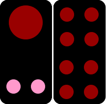
    <figcaption>小猴靠人</figcaption>
  </figure>

  

    

\( W = 1502 \)

  

  <figure style="text-align: center; margin: 0;">
      
      <figcaption>小猴靠八</figcaption>
    </figure>
    

  

\( W = 1502 \)

  

  <figure style="text-align: center; margin: 0;">
      
      <figcaption>小猴靠八</figcaption>
    </figure>
    

  

  

    

  

\( W = 1501 \)

  

  <figure style="text-align: center; margin: 0;">
      
      <figcaption>大猴靠人</figcaption>
    </figure>

  

  

  

\( W = 1501 \)

  

   <figure style="text-align: center; margin: 0;">
      
      <figcaption>大猴靠八</figcaption>
    </figure>

  

  

  

\( W = 1501 \)

  

  <figure style="text-align: center; margin: 0;">
      
      <figcaption>大猴靠八</figcaption>
    </figure>

  

  

### 对子

  

  

  

  

\( W = 1415 \)

  

    <figure style="text-align: center; margin: 0;">
      
      <figcaption>对天牌</figcaption>
    </figure>
    

  

  

\( W = 1414 \)

  

  <figure style="text-align: center; margin: 0;">
    
    <figcaption>对地牌</figcaption>
  </figure>
  

  

  

\( W = 1413 \)

  

  <figure style="text-align: center; margin: 0;">
    
    <figcaption>对人牌</figcaption>
  </figure>
  

  

\( W = 1412 \)

  

  <figure style="text-align: center; margin: 0;">
    
    <figcaption>对鹅牌</figcaption>
  </figure>
  

  

  

\( W = 1411 \)

  

  <figure style="text-align: center; margin: 0;">
    
    <figcaption>对麻包</figcaption>
  </figure>
  

  

  

  

  

\( W = 1410 \)

  

  <figure style="text-align: center; margin: 0;">
    
    <figcaption>对长三</figcaption>
  </figure>
  

  

  

\( W = 1409 \)

  

  <figure style="text-align: center; margin: 0;">
    
    <figcaption>对板凳</figcaption>
  </figure>
  

  

  

\( W = 1408 \)

  

  <figure style="text-align: center; margin: 0;">
    
    <figcaption>对斧贲</figcaption>
  </figure>
  

  

  

\( W = 1407 \)

  

  <figure style="text-align: center; margin: 0;">
    
    <figcaption>对黄ou</figcaption>
  </figure>
  

  

  

\( W = 1406 \)

  

  <figure style="text-align: center; margin: 0;">
    
    <figcaption>对黄旗</figcaption>
  </figure>
  

  

  

  

  

\( W = 1405 \)

  

  <figure style="text-align: center; margin: 0;">
    
    <figcaption>对锤蛋</figcaption>
  </figure>
  

  

  

\( W = 1404 \)

  

  <figure style="text-align: center; margin: 0;">
    
    <figcaption>对杂九</figcaption>
  </figure>
  

  

  

\( W = 1403 \)

  

  <figure style="text-align: center; margin: 0;">
    
    <figcaption>对杂八</figcaption>
  </figure>
  

  

  

\( W = 1402 \)

  

  <figure style="text-align: center; margin: 0;">
    
    <figcaption>对杂七</figcaption>
  </figure>
  

  

  

\( W = 1401 \)

  

  <figure style="text-align: center; margin: 0;">
    
    <figcaption>对杂五</figcaption>
  </figure>
  

  

### 天九王

  

  

  

\( W = 1301 \)

  

  <figure style="text-align: center; margin: 0;">
    
    <figcaption>天九王</figcaption>
  </figure>
  

  

  

\( W = 1301 \)

  

  <figure style="text-align: center; margin: 0;">
    
    <figcaption>天九王</figcaption>
  </figure>
  

### 天杠

  

  

  

  

\( W = 1201 \)

  

    <figure style="text-align: center; margin: 0;">
      
      <figcaption>天杠牌</figcaption>
    </figure>
    

  

  

\( W = 1201 \)

  

  <figure style="text-align: center; margin: 0;">
    
    <figcaption>天杠牌</figcaption>
  </figure>
  

  

  

\( W = 1201 \)

  

  <figure style="text-align: center; margin: 0;">
    
    <figcaption>对人牌</figcaption>
  </figure>
  

### 地杠

  

  

  

  

\( W = 1101 \)

  

    <figure style="text-align: center; margin: 0;">
      
      <figcaption>天杠牌</figcaption>
    </figure>
    

  

  

\( W = 1101 \)

  

  <figure style="text-align: center; margin: 0;">
    
    <figcaption>天杠牌</figcaption>
  </figure>
  

  

  

\( W = 1101 \)

  

  <figure style="text-align: center; margin: 0;">
    
    <figcaption>对人牌</figcaption>
  </figure>
  

### 九点

  

  

  

  

\( W = 1010 \)

  

    <figure style="text-align: center; margin: 0;">
      
      <figcaption>天九牌</figcaption>
    </figure>
    

  

  

\( W = 1010 \)

  

    <figure style="text-align: center; margin: 0;">
      
      <figcaption>天九牌</figcaption>
    </figure>
    

  

  

\( W = 1010 \)

  

    <figure style="text-align: center; margin: 0;">
      
      <figcaption>天九牌</figcaption>
    </figure>
    

   

  

\( W = 1009 \)

  

    <figure style="text-align: center; margin: 0;">
      
      <figcaption>地九牌</figcaption>
    </figure>
    

  

  

  

  

  

\( W = 1009 \)

  

    <figure style="text-align: center; margin: 0;">
      
      <figcaption>地九牌</figcaption>
    </figure>
    

  

  

\( W = 1009 \)

  

    <figure style="text-align: center; margin: 0;">
      
      <figcaption>地九牌</figcaption>
    </figure>
    

  

  

\( W = 1008 \)

  

    <figure style="text-align: center; margin: 0;">
      
      <figcaption>人九牌</figcaption>
    </figure>
    

   

  

\( W = 1007 \)

  

    <figure style="text-align: center; margin: 0;">
      
      <figcaption>鹅九牌</figcaption>
    </figure>
    

  

  

  

  

  

\( W = 1007 \)

  

    <figure style="text-align: center; margin: 0;">
      
      <figcaption>鹅九牌</figcaption>
    </figure>
    

  

  

\( W = 1006 \)

  

    <figure style="text-align: center; margin: 0;">
      
      <figcaption>麻包九</figcaption>
    </figure>
    

  

  

\( W = 1006 \)

  

    <figure style="text-align: center; margin: 0;">
      
      <figcaption>麻包九</figcaption>
    </figure>
    

   

  

\( W = 1005 \)

  

    <figure style="text-align: center; margin: 0;">
      
      <figcaption>长三九</figcaption>
    </figure>
    

  

  

  

  

  

\( W = 1004 \)

  

    <figure style="text-align: center; margin: 0;">
      
      <figcaption>板凳九</figcaption>
    </figure>
    

  

  

\( W = 1004 \)

  

    <figure style="text-align: center; margin: 0;">
      
      <figcaption>板凳九</figcaption>
    </figure>
    

  

  

\( W = 1003 \)

  

    <figure style="text-align: center; margin: 0;">
      
      <figcaption>斧贲九</figcaption>
    </figure>
    

   

  

\( W = 1003 \)

  

    <figure style="text-align: center; margin: 0;">
      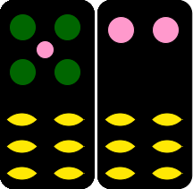
      <figcaption>斧贲九</figcaption>
    </figure>
    

  

  

  

  

  

\( W = 1002 \)

  

    <figure style="text-align: center; margin: 0;">
      
      <figcaption>黄ou九</figcaption>
    </figure>
    

  

  

\( W = 1002 \)

  

    <figure style="text-align: center; margin: 0;">
      
      <figcaption>黄ou九</figcaption>
    </figure>
    

  

  

\( W = 1001 \)

  

    <figure style="text-align: center; margin: 0;">
      
      <figcaption>锤蛋九</figcaption>
    </figure>
    

  

  

\( W = 1001 \)

  

    <figure style="text-align: center; margin: 0;">
      
      <figcaption>锤蛋九</figcaption>
    </figure>
    

  

### 八点

  

  

  

  

\( W = 908 \)

  

    <figure style="text-align: center; margin: 0;">
      
      <figcaption>天八牌</figcaption>
    </figure>
    

  

  

\( W = 908 \)

  

    <figure style="text-align: center; margin: 0;">
      
      <figcaption>天八牌</figcaption>
    </figure>
    

  

  

\( W = 908 \)

  

    <figure style="text-align: center; margin: 0;">
      
      <figcaption>天八牌</figcaption>
    </figure>
    

  

  

\( W = 907 \)

  

    <figure style="text-align: center; margin: 0;">
      
      <figcaption>地八牌</figcaption>
    </figure>
    

  

  

\( W = 907 \)

  

    <figure style="text-align: center; margin: 0;">
      
      <figcaption>地八牌</figcaption>
    </figure>
    

  

  

\( W = 907 \)

  

    <figure style="text-align: center; margin: 0;">
      
      <figcaption>地八牌</figcaption>
    </figure>
    

  

  

  

  

  

  

\( W = 906 \)

  

    <figure style="text-align: center; margin: 0;">
      
      <figcaption>人八牌</figcaption>
    </figure>
    

  

  

\( W = 906 \)

  

    <figure style="text-align: center; margin: 0;">
      
      <figcaption>人八牌</figcaption>
    </figure>
    

  

  

\( W = 905 \)

  

    <figure style="text-align: center; margin: 0;">
      
      <figcaption>鹅八牌</figcaption>
    </figure>
    

  

  

\( W = 904 \)

  

    <figure style="text-align: center; margin: 0;">
      
      <figcaption>麻包八</figcaption>
    </figure>
    

  

  

\( W = 904 \)

  

    <figure style="text-align: center; margin: 0;">
      
      <figcaption>麻包八</figcaption>
    </figure>
    

  

  

\( W = 903 \)

  

    <figure style="text-align: center; margin: 0;">
      
      <figcaption>斧贲八</figcaption>
    </figure>
    

  

  

  

  

  

  

\( W = 903 \)

  

    <figure style="text-align: center; margin: 0;">
      
      <figcaption>斧贲八</figcaption>
    </figure>
    

  

  

\( W = 903 \)

  

    <figure style="text-align: center; margin: 0;">
      
      <figcaption>斧贲八3</figcaption>
    </figure>
    

  

  

\( W = 902 \)

  

    <figure style="text-align: center; margin: 0;">
      
      <figcaption>黄ou八</figcaption>
    </figure>
    

  

  

\( W = 902 \)

  

    <figure style="text-align: center; margin: 0;">
      
      <figcaption>黄ou八</figcaption>
    </figure>
    

  

  

\( W = 901 \)

  

    <figure style="text-align: center; margin: 0;">
      
      <figcaption>八点牌</figcaption>
    </figure>
    

  

  

\( W = 901 \)

  

    <figure style="text-align: center; margin: 0;">
      
      <figcaption>八点牌</figcaption>
    </figure>
    

  

### 七点

  

  

  

  

\( W = 810 \)

  

    <figure style="text-align: center; margin: 0;">
      
      <figcaption>天七牌</figcaption>
    </figure>
    

  

  

\( W = 810 \)

  

    <figure style="text-align: center; margin: 0;">
      
      <figcaption>天七牌</figcaption>
    </figure>
    

  

  

\( W = 809 \)

  

    <figure style="text-align: center; margin: 0;">
      
      <figcaption>地七牌</figcaption>
    </figure>
    

  

  

\( W = 809 \)

  

    <figure style="text-align: center; margin: 0;">
      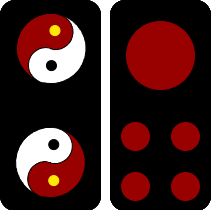
      <figcaption>地七牌</figcaption>
    </figure>
    

  

  

\( W = 808 \)

  

    <figure style="text-align: center; margin: 0;">
      
      <figcaption>人七牌</figcaption>
    </figure>
    

  

  

\( W = 808 \)

  

    <figure style="text-align: center; margin: 0;">
      
      <figcaption>人七牌</figcaption>
    </figure>
    

  

  

  

  

  

  

\( W = 807 \)

  

    <figure style="text-align: center; margin: 0;">
      
      <figcaption>鹅七牌</figcaption>
    </figure>
    

  

  

\( W = 806 \)

  

    <figure style="text-align: center; margin: 0;">
      
      <figcaption>麻包七</figcaption>
    </figure>
    

  

  

\( W = 806 \)

  

    <figure style="text-align: center; margin: 0;">
      
      <figcaption>麻包七</figcaption>
    </figure>
    

  

  

\( W = 806 \)

  

    <figure style="text-align: center; margin: 0;">
      
      <figcaption>麻包七</figcaption>
    </figure>
    

  

  

\( W = 805 \)

  

    <figure style="text-align: center; margin: 0;">
      
      <figcaption>长三七</figcaption>
    </figure>
    

  

  

\( W = 804 \)

  

    <figure style="text-align: center; margin: 0;">
      
      <figcaption>板凳七</figcaption>
    </figure>
    

  

  

  

  

  

  

\( W = 803 \)

  

    <figure style="text-align: center; margin: 0;">
      
      <figcaption>斧贲七</figcaption>
    </figure>
    

  

  

\( W = 803 \)

  

    <figure style="text-align: center; margin: 0;">
      
      <figcaption>斧贲七</figcaption>
    </figure>
    

  

  

\( W = 802 \)

  

    <figure style="text-align: center; margin: 0;">
      
      <figcaption>黄ou七</figcaption>
    </figure>
    

  

  

\( W = 802 \)

  

    <figure style="text-align: center; margin: 0;">
      
      <figcaption>黄ou七</figcaption>
    </figure>
    

  

  

\( W = 802 \)

  

    <figure style="text-align: center; margin: 0;">
      
      <figcaption>黄ou七</figcaption>
    </figure>
    

  

  

\( W = 801 \)

  

    <figure style="text-align: center; margin: 0;">
      
      <figcaption>七点牌</figcaption>
    </figure>
    

  

  

  

    

  

\( W = 801 \)

  

    <figure style="text-align: center; margin: 0;">
      
      <figcaption>七点牌</figcaption>
    </figure>
    

  

  

\( W = 801 \)

  

    <figure style="text-align: center; margin: 0;">
      
      <figcaption>七点牌</figcaption>
    </figure>
    

  

  

\( W = 801 \)

  

    <figure style="text-align: center; margin: 0;">
      
      <figcaption>七点牌</figcaption>
    </figure>
    

  

  

\( W = 801 \)

  

    <figure style="text-align: center; margin: 0;">
      
      <figcaption>七点牌</figcaption>
    </figure>
    

  

  

\( W = 801 \)

  

    <figure style="text-align: center; margin: 0;">
      
      <figcaption>七点牌</figcaption>
    </figure>
    

  

  

\( W = 801 \)

  

    <figure style="text-align: center; margin: 0;">
      
      <figcaption>七点牌</figcaption>
    </figure>
    

  

### 六点

  

  

  

  

\( W = 709 \)

  

    <figure style="text-align: center; margin: 0;">
      
      <figcaption>天六牌</figcaption>
    </figure>
    

  

  

\( W = 709 \)

  

    <figure style="text-align: center; margin: 0;">
      
      <figcaption>天六牌</figcaption>
    </figure>
    

  

  

\( W = 708 \)

  

    <figure style="text-align: center; margin: 0;">
      
      <figcaption>地六牌</figcaption>
    </figure>
    

  

  

\( W = 708 \)

  

    <figure style="text-align: center; margin: 0;">
      
      <figcaption>地六牌</figcaption>
    </figure>
    

  

  

\( W = 707 \)

  

    <figure style="text-align: center; margin: 0;">
      
      <figcaption>人六牌</figcaption>
    </figure>
    

  

  

  

  

  

\( W = 707 \)

  

    <figure style="text-align: center; margin: 0;">
      
      <figcaption>人六牌</figcaption>
    </figure>
    

  

  

\( W = 706 \)

  

    <figure style="text-align: center; margin: 0;">
      
      <figcaption>麻包六</figcaption>
    </figure>
    

  

  

\( W = 706 \)

  

    <figure style="text-align: center; margin: 0;">
      
      <figcaption>麻包六</figcaption>
    </figure>
    

  

  

\( W = 706 \)

  

    <figure style="text-align: center; margin: 0;">
      
      <figcaption>麻包六</figcaption>
    </figure>
    

  

  

\( W = 705 \)

  

    <figure style="text-align: center; margin: 0;">
      
      <figcaption>长三六</figcaption>
    </figure>
    

  

  

  

  

  

\( W = 704 \)

  

    <figure style="text-align: center; margin: 0;">
      
      <figcaption>斧贲六</figcaption>
    </figure>
    

  

  

\( W = 704 \)

  

    <figure style="text-align: center; margin: 0;">
      
      <figcaption>斧贲六</figcaption>
    </figure>
    

  

  

\( W = 703 \)

  

    <figure style="text-align: center; margin: 0;">
      
      <figcaption>黄ou六</figcaption>
    </figure>
    

  

  

\( W = 703 \)

  

    <figure style="text-align: center; margin: 0;">
      
      <figcaption>黄ou六</figcaption>
    </figure>
    

  

  

\( W = 702 \)

  

    <figure style="text-align: center; margin: 0;">
      
      <figcaption>黄旗六</figcaption>
    </figure>
    

  

  

  

  

  

\( W = 702 \)

  

    <figure style="text-align: center; margin: 0;">
      
      <figcaption>黄旗六</figcaption>
    </figure>
    

  

  

\( W = 701 \)

  

    <figure style="text-align: center; margin: 0;">
      
      <figcaption>六点牌</figcaption>
    </figure>
    

  

  

\( W = 701 \)

  

    <figure style="text-align: center; margin: 0;">
      
      <figcaption>六点牌</figcaption>
    </figure>
    

  

  

\( W = 701 \)

  

    <figure style="text-align: center; margin: 0;">
      
      <figcaption>六点牌</figcaption>
    </figure>
    

  

  

\( W = 701 \)

  

    <figure style="text-align: center; margin: 0;">
      
      <figcaption>六点牌</figcaption>
    </figure>
    

  

### 五点

  

  

  

\( W = 611 \)

  

    <figure style="text-align: center; margin: 0;">
      
      <figcaption>天五牌</figcaption>
    </figure>
    

  

  

\( W = 610 \)

  

    <figure style="text-align: center; margin: 0;">
      
      <figcaption>地五牌</figcaption>
    </figure>
    

  

  

\( W = 609 \)

  

    <figure style="text-align: center; margin: 0;">
      
      <figcaption>人五牌</figcaption>
    </figure>
    

  

  

\( W = 609 \)

  

    <figure style="text-align: center; margin: 0;">
      
      <figcaption>人五牌</figcaption>
    </figure>
    

  

  

\( W = 609 \)

  

    <figure style="text-align: center; margin: 0;">
      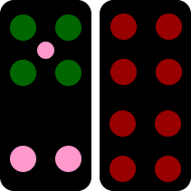
      <figcaption>人五牌</figcaption>
    </figure>
    

  

  

\( W = 608 \)

  

    <figure style="text-align: center; margin: 0;">
      
      <figcaption>鹅五牌</figcaption>
    </figure>
    

  

  

  

  

  

\( W = 607 \)

  

    <figure style="text-align: center; margin: 0;">
      
      <figcaption>麻包五</figcaption>
    </figure>
    

  

  

\( W = 607 \)

  

    <figure style="text-align: center; margin: 0;">
      
      <figcaption>麻包五</figcaption>
    </figure>
    

  

  

\( W = 606 \)

  

    <figure style="text-align: center; margin: 0;">
      
      <figcaption>长三五</figcaption>
    </figure>
    

  

  

\( W = 606 \)

  

    <figure style="text-align: center; margin: 0;">
      
      <figcaption>长三五</figcaption>
    </figure>
    

  

  

\( W = 605 \)

  

    <figure style="text-align: center; margin: 0;">
      
      <figcaption>板凳五</figcaption>
    </figure>
    

  

  

\( W = 604 \)

  

    <figure style="text-align: center; margin: 0;">
      
      <figcaption>黄ou五</figcaption>
    </figure>
    

  

  

  

  

  

\( W = 604 \)

  

    <figure style="text-align: center; margin: 0;">
      
      <figcaption>黄ou五</figcaption>
    </figure>
    

  

  

\( W = 603 \)

  

    <figure style="text-align: center; margin: 0;">
      
      <figcaption>黄旗五</figcaption>
    </figure>
    

  

  

\( W = 603 \)

  

    <figure style="text-align: center; margin: 0;">
      
      <figcaption>黄旗五</figcaption>
    </figure>
    

  

  

\( W = 602 \)

  

    <figure style="text-align: center; margin: 0;">
      
      <figcaption>锤蛋五</figcaption>
    </figure>
    

  

  

\( W = 602 \)

  

    <figure style="text-align: center; margin: 0;">
      
      <figcaption>锤蛋五</figcaption>
    </figure>
    

  

  

\( W = 601 \)

  

    <figure style="text-align: center; margin: 0;">
      
      <figcaption>五点牌</figcaption>
    </figure>
    

  

  

  

  

  

\( W = 601 \)

  

    <figure style="text-align: center; margin: 0;">
      
      <figcaption>五点牌</figcaption>
    </figure>
    

  

  

\( W = 601 \)

  

    <figure style="text-align: center; margin: 0;">
      
      <figcaption>五点牌</figcaption>
    </figure>
    

  

  

\( W = 601 \)

  

    <figure style="text-align: center; margin: 0;">
      
      <figcaption>五点牌</figcaption>
    </figure>
    

  

  

\( W = 601 \)

  

    <figure style="text-align: center; margin: 0;">
      
      <figcaption>五点牌</figcaption>
    </figure>
    

  

  

\( W = 601 \)

  

    <figure style="text-align: center; margin: 0;">
      
      <figcaption>五点牌</figcaption>
    </figure>
    

  

  

\( W = 601 \)

  

    <figure style="text-align: center; margin: 0;">
      
      <figcaption>五点牌</figcaption>
    </figure>
    

  

### 四点

  

  

  

\( W = 510 \)

  

    <figure style="text-align: center; margin: 0;">
      
      <figcaption>天四牌</figcaption>
    </figure>
    

  

  

\( W = 509 \)

  

    <figure style="text-align: center; margin: 0;">
      
      <figcaption>人四牌</figcaption>
    </figure>
    

  

  

\( W = 509 \)

  

    <figure style="text-align: center; margin: 0;">
      
      <figcaption>人四牌</figcaption>
    </figure>
    

  

  

\( W = 508 \)

  

    <figure style="text-align: center; margin: 0;">
      
      <figcaption>鹅四牌</figcaption>
    </figure>
    

  

  

\( W = 508 \)

  

    <figure style="text-align: center; margin: 0;">
      
      <figcaption>鹅四牌</figcaption>
    </figure>
    

  

  

\( W = 507 \)

  

    <figure style="text-align: center; margin: 0;">
      
      <figcaption>麻包四</figcaption>
    </figure>
    

  

  

  

  

  

\( W = 506 \)

  

    <figure style="text-align: center; margin: 0;">
      
      <figcaption>长三四</figcaption>
    </figure>
    

  

  

\( W = 506 \)

  

    <figure style="text-align: center; margin: 0;">
      
      <figcaption>长三四</figcaption>
    </figure>
    

  

  

\( W = 505 \)

  

    <figure style="text-align: center; margin: 0;">
      
      <figcaption>板凳四</figcaption>
    </figure>
    

  

  

\( W = 504 \)

  

    <figure style="text-align: center; margin: 0;">
      
      <figcaption>斧贲四</figcaption>
    </figure>
    

  

  

\( W = 503 \)

  

    <figure style="text-align: center; margin: 0;">
      
      <figcaption>黄旗四</figcaption>
    </figure>
    

  

  

\( W = 503 \)

  

    <figure style="text-align: center; margin: 0;">
      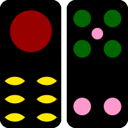
      <figcaption>黄旗四</figcaption>
    </figure>
    

  

  

  

  

  

\( W = 502 \)

  

    <figure style="text-align: center; margin: 0;">
      
      <figcaption>锤蛋四</figcaption>
    </figure>
    

  

  

\( W = 502 \)

  

    <figure style="text-align: center; margin: 0;">
      
      <figcaption>锤蛋四</figcaption>
    </figure>
    

  

  

\( W = 501 \)

  

    <figure style="text-align: center; margin: 0;">
      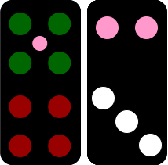
      <figcaption>四点牌</figcaption>
    </figure>
    

  

  

\( W = 501 \)

  

    <figure style="text-align: center; margin: 0;">
      
      <figcaption>四点牌</figcaption>
    </figure>
    

  

  

\( W = 501 \)

  

    <figure style="text-align: center; margin: 0;">
      
      <figcaption>四点牌</figcaption>
    </figure>
    

  

  

\( W = 501 \)

  

    <figure style="text-align: center; margin: 0;">
      
      <figcaption>四点牌</figcaption>
    </figure>
    

  

### 三点

  

  

  

\( W = 411 \)

  

    <figure style="text-align: center; margin: 0;">
      
      <figcaption>天三牌</figcaption>
    </figure>
    

  

  

\( W = 410 \)

  

    <figure style="text-align: center; margin: 0;">
      
      <figcaption>地三牌</figcaption>
    </figure>
    

  

  

\( W = 409 \)

  

    <figure style="text-align: center; margin: 0;">
      
      <figcaption>人三牌</figcaption>
    </figure>
    

  

  

\( W = 409 \)

  

    <figure style="text-align: center; margin: 0;">
      
      <figcaption>人三牌</figcaption>
    </figure>
    

  

  

\( W = 408 \)

  

    <figure style="text-align: center; margin: 0;">
      
      <figcaption>鹅牌三</figcaption>
    </figure>
    

  

  

\( W = 408 \)

  

    <figure style="text-align: center; margin: 0;">
      
      <figcaption>鹅牌三</figcaption>
    </figure>
    

  

  

  

  

  

\( W = 407 \)

  

    <figure style="text-align: center; margin: 0;">
      
      <figcaption>麻包三</figcaption>
    </figure>
    

  

  

\( W = 406 \)

  

    <figure style="text-align: center; margin: 0;">
      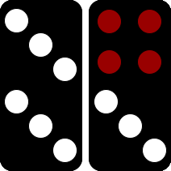
      <figcaption>长三三</figcaption>
    </figure>
    

  

  

\( W = 406 \)

  

    <figure style="text-align: center; margin: 0;">
      
      <figcaption>长三三</figcaption>
    </figure>
    

  

  

\( W = 406 \)

  

    <figure style="text-align: center; margin: 0;">
      
      <figcaption>长三三</figcaption>
    </figure>
    

  

  

\( W = 405 \)

  

    <figure style="text-align: center; margin: 0;">
      
      <figcaption>板凳三</figcaption>
    </figure>
    

  

  

\( W = 405 \)

  

    <figure style="text-align: center; margin: 0;">
      
      <figcaption>板凳三</figcaption>
    </figure>
    

  

  

  

  

  

\( W = 404 \)

  

    <figure style="text-align: center; margin: 0;">
      
      <figcaption>黄ou三</figcaption>
    </figure>
    

  

  

\( W = 403 \)

  

    <figure style="text-align: center; margin: 0;">
      
      <figcaption>黄旗三</figcaption>
    </figure>
    

  

  

\( W = 403 \)

  

    <figure style="text-align: center; margin: 0;">
      
      <figcaption>黄旗三</figcaption>
    </figure>
    

  

  

\( W = 402 \)

  

    <figure style="text-align: center; margin: 0;">
      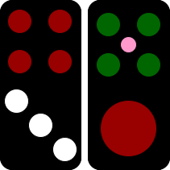
      <figcaption>锤蛋三</figcaption>
    </figure>
    

  

  

\( W = 402 \)

  

    <figure style="text-align: center; margin: 0;">
      
      <figcaption>锤蛋三</figcaption>
    </figure>
    

  

  

\( W = 401 \)

  

    <figure style="text-align: center; margin: 0;">
      
      <figcaption>三点牌</figcaption>
    </figure>
    

  

  

  

  

  

\( W = 401 \)

  

    <figure style="text-align: center; margin: 0;">
      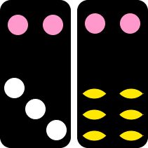
      <figcaption>三点牌</figcaption>
    </figure>
    

  

  

\( W = 401 \)

  

    <figure style="text-align: center; margin: 0;">
      
      <figcaption>三点牌</figcaption>
    </figure>
    

  

  

\( W = 401 \)

  

    <figure style="text-align: center; margin: 0;">
      
      <figcaption>三点牌</figcaption>
    </figure>
    

  

  

\( W = 401 \)

  

    <figure style="text-align: center; margin: 0;">
      
      <figcaption>三点牌</figcaption>
    </figure>
    

  

  

\( W = 401 \)

  

    <figure style="text-align: center; margin: 0;">
      
      <figcaption>三点牌</figcaption>
    </figure>
    

  

  

\( W = 401 \)

  

    <figure style="text-align: center; margin: 0;vi">
      
      <figcaption>三点牌</figcaption>
    </figure>
    

  

### 两点

  

  

  

\( W = 308 \)

  

    <figure style="text-align: center; margin: 0;">
      
      <figcaption>天二牌</figcaption>
    </figure>
    

   

  

\( W = 308 \)

  

    <figure style="text-align: center; margin: 0;">
      
      <figcaption>天二牌</figcaption>
    </figure>
    

  

  

\( W = 307 \)

  

    <figure style="text-align: center; margin: 0;">
      
      <figcaption>地二牌</figcaption>
    </figure>
    

  

  

\( W = 307 \)

  

    <figure style="text-align: center; margin: 0;">
      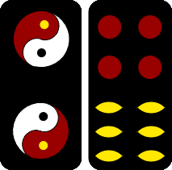
      <figcaption>地二牌</figcaption>
    </figure>
    

  

  

\( W = 306 \)

  

    <figure style="text-align: center; margin: 0;">
      
      <figcaption>人二牌</figcaption>
    </figure>
    

  

  

\( W = 306 \)

  

    <figure style="text-align: center; margin: 0;">
      
      <figcaption>人二牌</figcaption>
    </figure>
    

  

  

  

  

  

\( W = 305 \)

  

    <figure style="text-align: center; margin: 0;">
      
      <figcaption>鹅二牌</figcaption>
    </figure>
    

   

  

\( W = 305 \)

  

    <figure style="text-align: center; margin: 0;">
      
      <figcaption>鹅二牌</figcaption>
    </figure>
    

  

  

\( W = 304 \)

  

    <figure style="text-align: center; margin: 0;">
      
      <figcaption>长三二</figcaption>
    </figure>
    

  

  

\( W = 304 \)

  

    <figure style="text-align: center; margin: 0;">
      
      <figcaption>长三二</figcaption>
    </figure>
    

  

  

\( W = 303 \)

  

    <figure style="text-align: center; margin: 0;">
      
      <figcaption>板凳二</figcaption>
    </figure>
    

  

  

\( W = 303 \)

  

    <figure style="text-align: center; margin: 0;">
      
      <figcaption>板凳二</figcaption>
    </figure>
    

  

  

  

   

  

\( W = 302 \)

  

    <figure style="text-align: center; margin: 0;">
      
      <figcaption>黄旗二</figcaption>
    </figure>
    

  

  

\( W = 302 \)

  

    <figure style="text-align: center; margin: 0;">
      
      <figcaption>黄旗二</figcaption>
    </figure>
    

  

  

\( W = 301 \)

  

    <figure style="text-align: center; margin: 0;">
      
      <figcaption>二点牌</figcaption>
    </figure>
    

  

  

\( W = 301 \)

  

    <figure style="text-align: center; margin: 0;">
      
      <figcaption>二点牌</figcaption>
    </figure>
    

  

  

\( W = 301 \)

  

    <figure style="text-align: center; margin: 0;">
      
      <figcaption>二点牌</figcaption>
    </figure>
    

  

  

\( W = 301 \)

  

    <figure style="text-align: center; margin: 0;">
      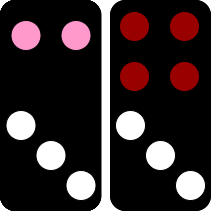
      <figcaption>二点牌</figcaption>
    </figure>
    

  

  

   

   

  

\( W = 301 \)

  

    <figure style="text-align: center; margin: 0;">
      
      <figcaption>二点牌</figcaption>
    </figure>
    

  

  

\( W = 301 \)

  

    <figure style="text-align: center; margin: 0;">
      
      <figcaption>二点牌</figcaption>
    </figure>
    

  

  

\( W = 301 \)

  

    <figure style="text-align: center; margin: 0;">
      
      <figcaption>二点牌</figcaption>
    </figure>
    

  

  

\( W = 301 \)

  

    <figure style="text-align: center; margin: 0;">
      
      <figcaption>二点牌</figcaption>
    </figure>
    

  

  

\( W = 301 \)

  

    <figure style="text-align: center; margin: 0;">
      
      <figcaption>二点牌</figcaption>
    </figure>
    

  

  

\( W = 301 \)

  

    <figure style="text-align: center; margin: 0;">
      
      <figcaption>二点牌</figcaption>
    </figure>
    

  

### 一点

  

  

  

\( W = 207 \)

  

    <figure style="text-align: center; margin: 0;">
      
      <figcaption>地一牌</figcaption>
    </figure>
    

  

  

\( W = 207 \)

  

    <figure style="text-align: center; margin: 0;">
      
      <figcaption>地一牌</figcaption>
    </figure>
    

  

  

\( W = 206 \)

  

    <figure style="text-align: center; margin: 0;">
      
      <figcaption>鹅一牌</figcaption>
    </figure>
    

  

  

\( W = 206 \)

  

    <figure style="text-align: center; margin: 0;">
      
      <figcaption>鹅一牌</figcaption>
    </figure>
    

  

  

  

  

  

\( W = 206 \)

  

    <figure style="text-align: center; margin: 0;">
      
      <figcaption>鹅一牌</figcaption>
    </figure>
    

  

  

\( W = 205 \)

  

    <figure style="text-align: center; margin: 0;">
      
      <figcaption>麻包一</figcaption>
    </figure>
    

  

  

\( W = 204 \)

  

    <figure style="text-align: center; margin: 0;">
      
      <figcaption>长三一</figcaption>
    </figure>
    

  

  

\( W = 204 \)

  

    <figure style="text-align: center; margin: 0;">
      
      <figcaption>长三一</figcaption>
    </figure>
    

  

   

  

  

  

\( W = 203 \)

  

    <figure style="text-align: center; margin: 0;">
      
      <figcaption>板凳一</figcaption>
    </figure>
    

  

  

\( W = 203 \)

  

    <figure style="text-align: center; margin: 0;">
      
      <figcaption>板凳一</figcaption>
    </figure>
    

  

  

\( W = 203 \)

  

    <figure style="text-align: center; margin: 0;">
      
      <figcaption>板凳一</figcaption>
    </figure>
    

  

  

\( W = 202 \)

  

    <figure style="text-align: center; margin: 0;">
      
      <figcaption>斧贲一</figcaption>
    </figure>
    

  

  

  

  

  

\( W = 201 \)

  

    <figure style="text-align: center; margin: 0;">
      
      <figcaption>一点牌</figcaption>
    </figure>
    

  

  

\( W = 201 \)

  

    <figure style="text-align: center; margin: 0;">
      
      <figcaption>一点牌</figcaption>
    </figure>
    

  

  

\( W = 201 \)

  

    <figure style="text-align: center; margin: 0;">
      
      <figcaption>一点牌</figcaption>
    </figure>
    

  

  

\( W = 201 \)

  

    <figure style="text-align: center; margin: 0;">
      
      <figcaption>一点牌</figcaption>
    </figure>
    

  

### 鳖十

  

  

  

\( W = 101 \)

  

    <figure style="text-align: center; margin: 0;">
      
      <figcaption>鳖十牌</figcaption>
    </figure>
    

  

  

\( W = 101 \)

  

    <figure style="text-align: center; margin: 0;">
      
      <figcaption>鳖十牌</figcaption>
    </figure>
    

  

  

\( W = 101 \)

  

    <figure style="text-align: center; margin: 0;">
      
      <figcaption>鳖十牌</figcaption>
    </figure>
    

  

  

\( W = 101 \)

  

    <figure style="text-align: center; margin: 0;">
      
      <figcaption>鳖十牌</figcaption>
    </figure>
    

  

  

   

  

  

\( W = 101 \)

  

    <figure style="text-align: center; margin: 0;">
      
      <figcaption>鳖十牌</figcaption>
    </figure>
    

  

  

\( W = 101 \)

  

    <figure style="text-align: center; margin: 0;">
      
      <figcaption>鳖十牌</figcaption>
    </figure>
    

  

  

\( W = 101 \)

  

    <figure style="text-align: center; margin: 0;">
      
      <figcaption>鳖十牌</figcaption>
    </figure>
    

  

  

\( W = 101 \)

  

    <figure style="text-align: center; margin: 0;">
      
      <figcaption>鳖十牌</figcaption>
    </figure>
    

  

  

  

  

  

\( W = 101 \)

  

    <figure style="text-align: center; margin: 0;">
      
      <figcaption>鳖十牌</figcaption>
    </figure>
    

  

  

\( W = 101 \)

  

    <figure style="text-align: center; margin: 0;">
      
      <figcaption>鳖十牌</figcaption>
    </figure>
    

  

  

\( W = 101 \)

  

    <figure style="text-align: center; margin: 0;">
      
      <figcaption>鳖十牌</figcaption>
    </figure>
    

  

  

\( W = 101 \)

  

    <figure style="text-align: center; margin: 0;">
      
      <figcaption>鳖十牌</figcaption>
    </figure>
    

  

本文尽可能详尽地列出了所有牌型组合及其权重，但仍可能存在遗漏。通过本文提供的牌型权重，玩家可以更直观地比较各类牌型的大小，从而在游戏中做出更合理的判断与策略决策，提升博弈能力。

## 结语

牌九作为中国传统文化中的重要棋牌类游戏，不仅蕴含深厚的历史底蕴，更以其独特的规则和策略性吸引了无数玩家。新蔡县域的牌九玩法在传统规则的基础上，融合了地方特色，使其更具趣味性和挑战性，成为当地民间文化的重要组成部分。

通过本文的介绍，玩家不仅能够掌握新蔡县域牌九的基本规则和牌型特点，还能深入理解其博弈策略，提高实战技巧。无论是初学者还是资深玩家，都可以通过不断实践，提升对牌九的掌控能力，从而在游戏中获得更多乐趣。

需要特别说明的是，本文旨在提供有关牌九的规则、玩法和策略的介绍，仅供娱乐和学习参考。使用本文所包含的信息所产生的任何后果，包括但不限于法律责任、经济损失或其他风险，均由使用者自行承担。请读者严格遵守所在地区的法律法规，合理、合法地参与相关活动。

    
    

